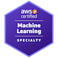

## Data Generalist / Full-Stack Data Scientist

Hi, I am a seasoned AI/ML professional focused on AI/ML in the Healthcare & Life Sciences industry :microscope: 🩺 🏥. 

My career has spanned various roles, including R&D at Masimo, a medical devices company, and my current position as Senior AI Solutions Architect at AWS in the Global Healthcare Lifesciences (HCLS) team.
Previously, I served as AI/ML Tech Lead at AWS Consulting Partner TensorIoT, where I led and scoped complex AI Machine Learning projects, with a focus on GenAI. I also worked as a Full-Stack Data Scientist in AWS Professional Services, delivering ML solutions and AI platforms for healthcare clients, including pharmaceutical industry leaders and healthcare providers.

My expertise extends to diverse areas such as Generative AI, Computer Vision, Natural Language Processing, as well as more traditional machine learning approaches involving tabular data

My main programming language is Python, but I also have experience in C++, JavaScript and R. 

I speak german, french, english and some spanish.

I am currently based in New York City :us: 

### What I am currently excited about
* Large Language Models: AWS Bedrock, Model Fine-tuning, Agentic workflows
* Digital Pathology Foundation Models
* Precision Medicine, Gene Therapy & Wearables

### Skills

* Data Architecture / Data Engineering
* Data analysis and visualization
* Machine learning and statistical modeling
* Machine Learning Operations (MLOps)
* AWS Subject Mattter Expert
* DevOps (IaC, Docker, GitHub Action)
* API integration
* Healthcare Data, Good Clinical Practice, ICD10, CPT Codes, FHIRv7
* Project Scoping / Project Management / Pre-Sales work 

### Education

* Master's Degree in MS&E, [Columbia University](https://mse.ieor.columbia.edu/)
* Diplôme d'ingénieur, Applied Mathematics / Material Sciences, [Ecole des Ponts ParisTech](https://ecoledesponts.fr/en/welcome-school)
* Classe préparatoire aux Grandes Ecoles CPGE, [Lycee Sainte Genevieve](https://www.bginette.com/)

### Experience
* **Amazon Web Services (AWS)**, Sr AI Solutions Architect
  * Currently part of the Global Healthcare&Life Sciences team at AWS
  * Digital Pathology work [here](https://github.com/aws-samples/ai-digital-pathology)
   
* **TensorIoT (AWS Partner)**, AI/ML Tech Lead
  * Led and scoped the technical delivery of AI projects, focussing moslty on GenAI projects: e.g.[Eversana](https://www.eversana.com/2023/11/27/eversana-builds-on-commitment-to-pharmatize-ai-with-amazon-web-services-introduces-transformative-medical-regulatory-review-solution/?utm_source=EVERSANA&utm_medium=Press+release&utm_campaign=AWS_GenAI)
  
* **Amazon Web Services (AWS)**, Data Science Lead 
  * Worked with multiple healthcare clients (healthcare providers, pharmaceutical companies) on AI solutions: Some select projects are publicly referencable such as here with [Gilead Sciences](https://aws.amazon.com/solutions/case-studies/gilead-data-case-study/), or [Moderna](https://aws.amazon.com/solutions/case-studies/moderna-commercialization-case-study/). Worked with EHR Data, Multi-omics data, Waveform Data. ML Architecture / Data Science / MLOps
* **Masimo**, AI Engineering
  * Built AI powered medical devices: Projects involved working with Electronic Health Records, Embedded Devices (NVDIA Jetsons), Good Clinical Practices. See these two press releases for two projects I worked on [Visual Clinical Activity Monitoring](https://investor.masimo.com/news/news-details/2023/Masimo-Announces-the-Limited-Market-Release-of-Visual-Clinical-Activity-Monitoring-VCAM/default.aspx) and  [Sepsis Index Clinical Decision Support](https://investor.masimo.com/news/news-details/2022/Masimo-Announces-Limited-Market-Release-of-Sepsis-Index/default.aspx)
* **Capgemini**, Data Science
  * Worked on mulitple Data Science and Data Engineering enegagments across multiple industries
  * Developed multiple core data lake applications for a Cloud Migrations to Microsoft Azure using Databricks / Spark / SparkML
  * Led an engagment for an Entity Matching project using SparkML and Databricks

* **Louis Vuitton**, Data Science
  * Worked part-time during Graduate School and built ML tools to help the Logistics team do Demand Forecasting.

and in a previous life...
* **Air Liquide**, Project Engineer, Hydrogen Cars
* **Airbus Helicopters** / Sogeti , Material Science Engineer, Rotor & Fluid Mechanics

### Certifications

* [AWS Certified Solutions Architect - Professional](https://www.credly.com/badges/b6cdb9bd-03ae-4884-b786-d09db0d100e7/public_url)
* [AWS Certified Solutions Architect - Associate](https://www.credly.com/badges/d9289955-c415-4d42-a93e-4c2e4b17e500/linked_in_profile)
* [AWS Certied Machine Learning Specialty](https://www.credly.com/badges/1f04f054-fc3d-4fd2-ad79-43f812e0092e/linked_in_profile)
* [AWS Certified Developer](https://www.credly.com/badges/30b282cf-803e-4d63-91e2-5efd0941c468?source=linked_in_profile)

### Publications and Blog Posts
* Accelerate digital pathology workflows on AWS [AWS Blog Post](https://aws.amazon.com/blogs/machine-learning/accelerate-digital-pathology-slide-annotation-workflows-on-aws-using-h-optimus-0/)
* Move Amazon SageMaker Autopilot ML models from experimentation to production using Amazon SageMaker Pipelines, [AWS Blog Post](https://aws.amazon.com/blogs/machine-learning/move-amazon-sagemaker-autopilot-ml-models-from-experimentation-to-production-using-amazon-sagemaker-pipelines/)
  * Blog post on how to build MLOps infrastructure around SageMaker Autopilot

* System and Method for Monitoring Clinical Activities, [US PATENT](https://image-ppubs.uspto.gov/dirsearch-public/print/downloadPdf/20210256267)
  * US Patent for the work I did while working for Masimo
 
 ## Speaking Engagements
 * [Biomolecular Imaging and Informatics (SBI2)](https://sbi2.org/past-conferences/), Boston 2024, *Transforming Digital Pathology through the convergence of Cloud*
and Generative AI
 * [AWS Life Sciences Symposium](https://aws.amazon.com/health/life-sciences-symposium-2025/), New York, 2025, *End-to-end productivity for data & AI teams with Amazon SageMaker Unified Studio*
 * [AWS New York Summit](https://aws.amazon.com/events/summits/new-york/?trk=c3966d3c-23de-4937-89f8-3d5f25e808c6&utm_custom=c3966d3c-23de-4937-89f8-3d5f25e808c6&sc_channel=el), New York, 2025, *HLS202 - Builders - Building Intelligent AI Agents for Life Sciences Innovation*

 ### Contact Me

Feel free to reach out to me for collaboration, job opportunities, or any other inquiries.

* LinkedIn: [LinkedIn Profile](https://www.linkedin.com/in/pierre-de-malliard/)
* Twitter: [@PMalliard](https://twitter.com/PMalliard)

---

Thank you for visiting my GitHub Page. Don't hesitate to explore my projects and reach out to me. I look forward to connecting with you!

_last updated on March 31st, 2025_
