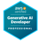
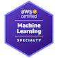

## Building AI for Healthcare & Life Sciences

I design production AI systems that improve patient care and help teams ship at enterprise scale.

I'm a Senior AI Solutions Architect at AWS, working with healthcare providers, pharma, MedTech, and payers on the Global Healthcare & Life Sciences team. My job is part engineering, part strategy: figuring out where AI actually moves the needle in healthcare, then building it.

I started in applied mathematics and material sciences, and it turns out that learning to model physical systems is a great foundation for modern AI. I later got a M.S. in Management Science & Engineering, a joint program between the School of engineering and Columbia Business School: I aspire to continue to develop both my "hard-skills" of Science and Engineering and to drive business impact.

I have worked in technology for over a decade, and in Healthcare & Life Sciences for more than 8 years: I joined a medical device company and started putting AI into clinical products, both for clinical decision support systems as well as for smart hospitals. I've been in healthcare AI since, working on Data Science and MLOps projects while at AWS Professional Services, leading a GenAI practice at TensorIoT, an AWS partner, and now shaping AI strategy for some of the largest life sciences organizations in the world as part of the AWS Healthcare & Life Sciences team.

I speak English 🇺🇸, German 🇩🇪, French 🇫🇷, and Spanish 🇪🇸

I am currently based in New York City.

### Point of View

* Everyone has access to the same public models. The real advantage is private data: how you structure it, how you extract signal from multimodal sources,
and who gets access to what. (Data infrastructure & governance, FM training)
* The other bottleneck is inference cost. Custom silicon (I spend a lot of time on AWS Neuron chips and NKI kernels), model fine-tuning, and rigorous agentic evaluation are what determine whether healthcare AI scales. Model routing is a science in itself. 

### Guides

* [Neuron Performance Book](/neuron-performance-book/) — A practitioner's guide to profiling and optimizing models on AWS Trainium & Inferentia

### Publications & Patents

* [Human-in-the-loop constructs for agentic workflows in Healthcare & Life Sciences](https://aws.amazon.com/blogs/machine-learning/human-in-the-loop-constructs-for-agentic-workflows-in-healthcare-and-life-sciences/) — AWS Blog
* [A guide to building AI agents in GxP environments](https://aws.amazon.com/blogs/machine-learning/a-guide-to-building-ai-agents-in-gxp-environments/) — AWS Blog
* [Build a biomedical research agent with Biomni tools and Amazon Bedrock AgentCore](https://aws.amazon.com/blogs/machine-learning/build-a-biomedical-research-agent-with-biomni-tools-and-amazon-bedrock-agentcore-gateway/) — AWS Blog
* [Accelerate digital pathology slide annotation workflows on AWS](https://aws.amazon.com/blogs/machine-learning/accelerate-digital-pathology-slide-annotation-workflows-on-aws-using-h-optimus-0/) — AWS Blog
* [Move SageMaker Autopilot ML models from experimentation to production using SageMaker Pipelines](https://aws.amazon.com/blogs/machine-learning/move-amazon-sagemaker-autopilot-ml-models-from-experimentation-to-production-using-amazon-sagemaker-pipelines/) — AWS Blog
* [System and Method for Monitoring Clinical Activities](https://image-ppubs.uspto.gov/dirsearch-public/print/downloadPdf/20210256267) — US Patent

### Speaking

* **CitiusTech 2026**, Atlantic City — *AI for Healthcare & Life Sciences: Building for Breakthroughs* (keynote)
* **AWS Life Sciences Symposium 2026**, NYC — *Multi-Agents with A2A & MCP on AgentCore* (workshop)
* **AWS re:Invent 2025**, Las Vegas — *AI and HCP Engagement: Powering Smarter Life Sciences Field Operations*
* **AWS Life Sciences Symposium 2025**, NYC — *End-to-end productivity for data & AI teams with Amazon SageMaker Unified Studio*
* **AWS New York Summit 2025** — *Building Intelligent AI Agents for Life Sciences Innovation*
* **AstraZeneca 2024** — *Preparing for an Agentic Future*, Global Ethics & Compliance Executive Panel
* **SBI2 2024**, Boston — *Transforming Digital Pathology through the Convergence of Cloud and Generative AI*

### Select Projects

* [AI Digital Pathology on AWS](https://github.com/aws-samples/ai-digital-pathology) — open-source framework for digital pathology workflows
* [Eversana × TensorIoT](https://www.eversana.com/2023/11/27/eversana-builds-on-commitment-to-pharmatize-ai-with-amazon-web-services-introduces-transformative-medical-regulatory-review-solution/) — GenAI-powered medical regulatory review
* [Gilead Sciences](https://aws.amazon.com/solutions/case-studies/gilead-data-case-study/) — ML solutions for pharmaceutical R&D
* [Moderna](https://aws.amazon.com/solutions/case-studies/moderna-commercialization-case-study/) — AI platform for commercialization
* [Masimo VCAM](https://investor.masimo.com/news/news-details/2023/Masimo-Announces-the-Limited-Market-Release-of-Visual-Clinical-Activity-Monitoring-VCAM/default.aspx) — Visual Clinical Activity Monitoring (AI medical device)
* [Masimo Sepsis Index](https://investor.masimo.com/news/news-details/2022/Masimo-Announces-Limited-Market-Release-of-Sepsis-Index/default.aspx) — Clinical decision support for sepsis detection

### Experience

* **Amazon Web Services** — Sr. AI Solutions Architect, Global Healthcare & Life Sciences (current)
* **TensorIoT (AWS Partner)** — AI/ML Tech Lead
* **Amazon Web Services** — Data Science Lead, Professional Services
* **Masimo** — AI Engineer, Medical Devices
* **Capgemini** — Data Scientist
* **Air Liquide** — Project Engineer, Hydrogen Fuel Cells
* **Airbus Helicopters / Sogeti** — Material Science Engineer

### Education

* M.S. Management Science & Engineering — [Columbia University](https://mse.ieor.columbia.edu/)
* Diplôme d'ingénieur, Applied Mathematics & Material Sciences — [École des Ponts ParisTech](https://ecoledesponts.fr/en/welcome-school)
* Classe préparatoire (CPGE) — [Lycée Sainte-Geneviève](https://www.bginette.com/)

### Certifications

* [AWS Certified Generartive AI Developer - Profesional]()
* [AWS Certified Solutions Architect — Professional](https://www.credly.com/badges/b6cdb9bd-03ae-4884-b786-d09db0d100e7/public_url)
* [AWS Certified Solutions Architect — Associate](https://www.credly.com/badges/d9289955-c415-4d42-a93e-4c2e4b17e500/linked_in_profile)
* [AWS Certified Machine Learning — Specialty](https://www.credly.com/badges/1f04f054-fc3d-4fd2-ad79-43f812e0092e/linked_in_profile)
* [AWS Certified Developer — Associate](https://www.credly.com/badges/30b282cf-803e-4d63-91e2-5efd0941c468?source=linked_in_profile)

Interested in having me speak or want to talk? Reach out:

### Contact

* LinkedIn: [pierre-de-malliard](https://www.linkedin.com/in/pierre-de-malliard/)
* Twitter: [@PMalliard](https://twitter.com/PMalliard)

---

_Last updated May 2026_
